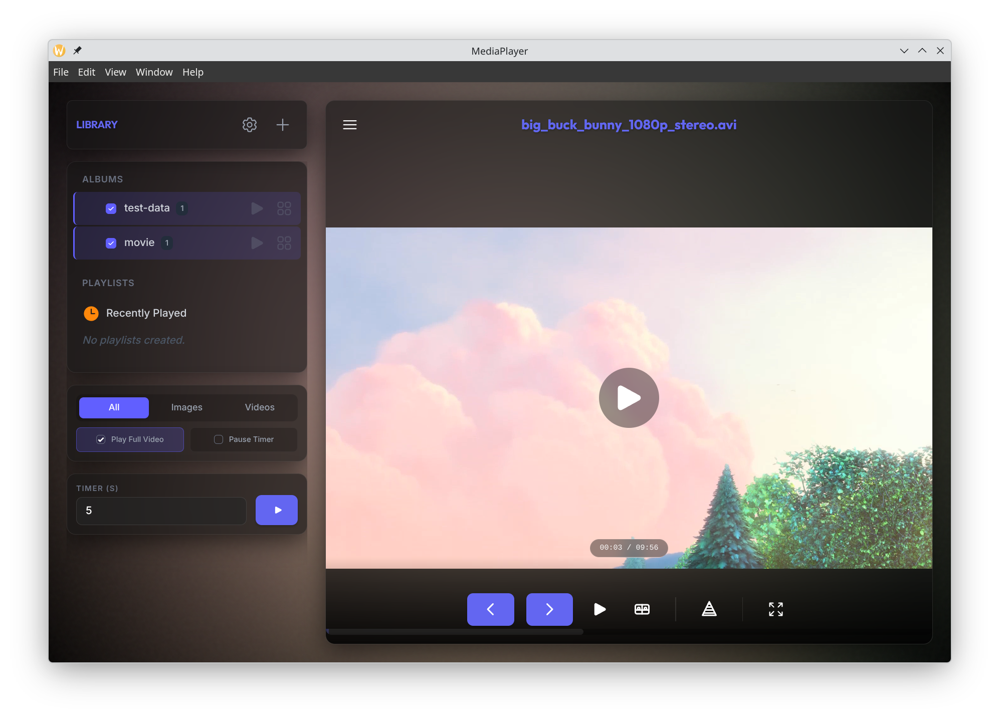

# MediaPlayer

[](https://opensource.org/licenses/MIT) [](https://www.typescriptlang.org/) [](https://vuejs.org/) [](https://www.electronjs.org/) [](https://vitest.dev/) [](https://github.com/daanbouwman19/Mediaplayer/actions/workflows/ci.yml)



A versatile media application that runs as both a **Desktop Application** (Electron) for local playback and a **Web Server** for accessing your library from any browser. It focuses on creating dynamic, weighted slideshows and organizing your local media.

## Features

- **Dual Mode**:
  - **Desktop App**: A standalone Electron application for your local machine.
  - **Web Server**: Host your library and access it from any device in your network.
- **Responsive Design**: The entire application is fully responsive and optimized for both desktop and mobile devices.
- **FFmpeg Transcoding**: Automatically transcodes non-native video formats (like .mov or .mkv) on the fly for seamless playback in any browser.
- **Google Drive Support**: Connect your Google Drive to stream media directly from the cloud without using local storage.
- **Album-Based Organization**: Automatically groups media files based on their parent directory.
- **Unified Media Viewer**: Supports images and videos. Large videos are streamed efficiently.
- **Video Rating Mode**: A specialized interface for quickly rating media.
- **Weighted Random Slideshows**: Smart slideshows that prioritize less-viewed content to keep your viewing experience fresh.
- **Smart Playlists**: Create dynamic playlists based on custom rules (e.g., "Favorites", "Unwatched", "Specific Folders").
- **View Count Tracking**: Tracks usage to inform the weighting algorithms.
- **Persistent Cache**: Uses SQLite to cache the library index for instant startups.

## Tech Stack

- **Core**: [TypeScript](https://www.typescriptlang.org/)
- **Desktop Framework**: [Electron](https://www.electronjs.org/)
- **Web Framework**: [Vue 3](https://vuejs.org/)
- **Build Tool**: [electron-vite](https://electron-vite.org/)
- **Database**: [sqlite3](https://github.com/TryGhost/node-sqlite3)
- **Media Processing**: [FFmpeg](https://ffmpeg.org/)
- **Styling**: [Tailwind CSS](https://tailwindcss.com/)
- **Testing**: [Vitest](https://vitest.dev/)

## Project Structure

The project is organized into a modular structure to support both the Electron and Server environments sharing core logic:

- `src/core/`: **Shared Business Logic**. Contains the database layer, media scanning, media handling, and file system abstractions used by both the Electron main process and the Web Server.
- `src/main/`: **Electron Main Process**. Handles window management, native menus, and IPC for the desktop version.
- `src/server/`: **Web Server**. The entry point for the standalone web server mode.
- `src/renderer/`: **Frontend**. The Vue 3 application that serves as the UI for both modes.
- `src/preload/`: **Electron Preload**. Bridges the gap between the Electron main process and the renderer.
- `src/shared/`: **Shared Contracts**. TypeScript interfaces and IPC channel definitions shared between main, scanner, and renderer processes.

## Database Schema

<details>
<summary>Click to view database schema</summary>

The application uses SQLite to store metadata and cache.

- **`media_views`**: Tracks view history.
  - `file_path_hash` (PK), `file_path` (Unique), `view_count`, `last_viewed`
- **`media_metadata`**: Caches file attributes.
  - `file_path_hash` (PK), `file_path`, `duration`, `size`, `created_at`, `rating`, `extraction_status`
- **`media_directories`**: Managed source folders.
  - `id` (PK), `path` (Unique), `type`, `name`, `is_active`
- **`smart_playlists`**: Dynamic playlist definitions.
  - `id` (PK), `name`, `criteria`, `createdAt`
- **`settings`**: Key-value data store.
  - `key` (PK), `value`, `updated_at`
- **`app_cache`**: General purpose cache.
  - `cache_key` (PK), `cache_value`, `last_updated`

</details>

## Development

### Prerequisites

- [Node.js](https://nodejs.org/) (Version 25)
- C++/Python build tools for native modules (`sqlite3`).

### Setup

Clone the repository:

```bash
git clone <repository-url>
cd <repository-directory>
```

Install dependencies:

```bash
npm install
```

### Running

**Desktop Dev Mode**:

```bash
npm run dev
```

**Web Server Dev Mode**:

```bash
npm run dev:all
```

### Testing

Run all tests:

```bash
npm test
```

## Building

To package the application for your OS:

```bash
npm run package
```

The output will be in the `out/` directory.

## Contributing

1. Fork the repo.
2. Create a feature branch.
3. Make your changes.
4. Run formatting:

   ```bash
   npm run format
   ```

5. Commit your changes.
6. Push and open a Pull Request.
